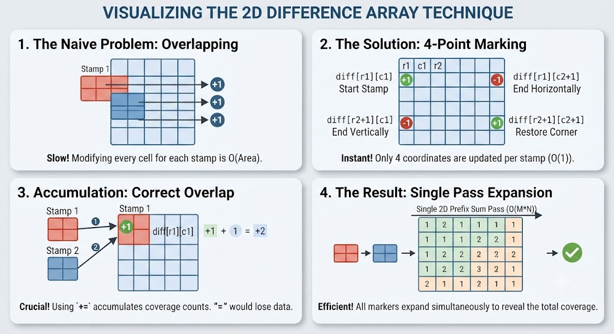

theory used for this question
# 2D differential Array method

The **2D Difference Array** (also called a 2D range update array) is a technique used to apply **range updates to a matrix in $O(1)$ time** instead of updating every single element with a nested loop.

If you want to add a value $v$ to an entire subgrid from row $r_1$ to $r_2$ and column $c_1$ to $c_2$, doing it the naive way takes $O(\text{height} \times \text{width})$ time. With a difference array, you only change **4 numbers**, and then expand them all at once at the very end.

---

### The Standard Way: Step-by-Step

#### 1. Setup

Create a difference matrix (let's call it `diff`) that is slightly larger than your original grid to handle outer boundary limits safely (usually size `(row + 2) x (col + 2)`). Initialize all values to `0`.

#### 2. The 4-Point Update Rule

Whenever you want to add a value `val` (in your problem, `val = 1`) to a rectangle bounded by top-left `(r1, c1)` and bottom-right `(r2, c2)`, you apply these 4 updates:

```python
diff[r1][c1] += val       # 1. Start the range addition
diff[r1][c2 + 1] -= val   # 2. Cancel it out horizontally past the right edge
diff[r2 + 1][c1] -= val   # 3. Cancel it out vertically past the bottom edge
diff[r2 + 1][c2 + 1] += val # 4. Restore the overlapping corner region

```

#### 3. The Reconstruction (Prefix Sum Pass)

After you have processed all your stamp placements, you run a standard **2D prefix sum** over the `diff` array. This causes the `+1` and `-1` markers to ripple outwards and fill the entire rectangle with the correct accumulated counts:

```python
for i in range(1, row + 1):
    for j in range(1, col + 1):
        diff[i][j] += diff[i][j-1] + diff[i-1][j] - diff[i-1][j-1]

```

Once this loop finishes, every cell in `diff[i][j]` will instantly hold the exact number of times it was covered by a stamp!

---
